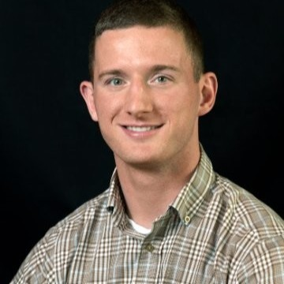

# **Code Fellows Reading Notes**

This site serves as a central location to store and display all reading notes associated with all Code Fellows courses taken by myself, Benjamin Small.

## Code 401 - Advanced Software Development

### Classes

1. [Intro to Python Course](Code401/Class-01.md)
2. [Testing and Modules](Code401/Class-02.md)
3. [FileIO and Exceptions](Code401/Class-03.md)
4. [Classes, Objects, Recursion, and Testing](Code401/Class-04.md)
5. [Linked Lists](Code401/Class-05.md)
6. [Ten Thousand Game 1](Code401/Class-06.md)
7. [Ten Thousand Game 2](Code401/Class-07.md)
8. [Ten Thousand Game 3](Code401/Class-08.md)
9. [Jupyter Lab and Numpy](Code401/Class-11.md)
10. [Pandas](Code401/Class-12.md)
11. [Linear Regressions](Code401/Class-13.md)
12. [Matplotlib](Code401/Class-14.md)
13. [Trees](Code401/Class-15.md)
14. [Serverless Computing](Code401/Class-16.md)
15. [Web Scraping](Code401/Class-17.md)
16. [Cryptography](Code401/Class-18.md)
17. [Automation](Code401/Class-19.md)
18. [Django](Code401/Class-26.md)
19. [Django Models](Code401/Class-27.md)
20. [Django Crud and Forms](Code401/Class-28.md)
21. [Django Custom User](Code401/Class-29.md)
22. [Hash Tables](Code401/Class-30.md)
23. [Django & Docker](Code401/Class-31.md)
24. [Permissions & Postgresql](Code401/Class-32.md)

### Other Readings

1. [Engineering Readings](Code401/Engineering_Readings.md)

### Prework

1. [The Command Line](Code401/prework/Command_Line.md)
2. [Intro to SQL](Code401/prework/SQL_Intro)
3. [Growth Mindset](Code401/preworkd/Growth_Mindset.md)

## Code 301 - Intermediate Software Development

1. [Introduction to React and Components](Code301/Class-01.md)
2. [State and Props](Code301/Class-02.md)
3. [Passing Functions as Props](Code301/Class-03.md)
4. [React and Forms](Code301/Class-04.md)
5. [Putting it all Together](Code301/Class-05.md)
6. [NODE.JS](Code301/Class-06.md)
7. [Representational State Transfer](Code301/Class-07.md)
8. [APIs](Code301/Class-08.md)
9. [Functional Programming](Code301/Class-09.md)
10. [In Memory Stage](Code301/Class-10.md)
11. [Mongo and Mongoose](Code301/Class-11.md)
12. [CRUD](Code301/Class-12.md)
13. [More CRUD](Code301/Class-13.md)
14. [Diversity & Inclusion in the Tech Industry](Code301/Class-14.md)
15. [Authentication](Code301/Class-15.md)

## Code 201 - Foundations of Software Development

1. [Class 1: HTML, CSS, Javascript Refresher](Code201/Class-01.md)
2. [Class 2: More Web Programming Basics](Code201/Class-02.md)
3. [Class 3: HTML Lists, JS Control Flow, CSS Box Model](Code201/Class-03.md)
4. [Class 4: HTML Links, JS Functions, and CSS Layout](Code201/Class-04.md)
5. [Class 5: Images, Color, and Text](Code201/Class-05.md)
6. [Class 6: Object Literals and the Document Object Model](Code201/Class-06.md)
7. [Class 7: Object-Oriented Programming, HTML Tables](Code201/Class-07.md)
8. [Class 8: CSS Layout](Code201/Class-08.md)
9. [Class 9: Forms and JS Events](Code201/Class-09.md)
10. [Class 10: Debugging](Code201/Class-10.md)
11. [Class 11: Audio, Video, Images](Code201/Class-11.md)
12. [Class 12: Char.js and Canvas](Code201/Class-12.md)
13. [Class 13: Local Storage for Web Applications](Code201/Class-13.md)
14. [Class 14: CSS Transforms, Transitions, and Animations & What Google Learned About Teams](Code201/Class-14.md)

## Code 102 - Intro to Software Development

1. [The Growth Mindset](Code102/GrowthMindset.md)
2. [Markdown Syntax](Code102/MarkdownGuide.md)
3. [Git Hub Pages](Code102/Pages.md)
4. [The Coder's Computer](Code102/CodersComputer.md)
5. [Revisions and the Cloud](Code102/CloudRevisions.md)
6. [HTML, Semantics, and Wire Diagrams](Code102/html-wires-semantics.md)
7. [CSS](Code102/css.md)
8. [Javascript and Computer Basics](Code102/js-and-Computers.md)
9. [Javascript 2](Code102/Javascript2.md)
10. [Operators and Loops](Code102/Operators-Loops.md)

---

### **Bio**

Benjamin Small is a 2016 University of Washington ISE alumni who has always been interested in coding. However, after University he spent 5 years on active duty orders as an Army Aviation Officer and Blackhawk UH-60 pilot. After completing his time of full time military service, capped off with a year long overseas deployment, he finally decided to pursue his passion of computer coding and attend a Seattle Based Coding Bootcamp *Code Fellows*. He is a hyper-focused, detail oriented, clever minded individual who does not shy away from hard tasks!

He loves trying new food, playing team and individual sports (including disc gold and ping pong!), skiing awesome mountains, and traveling the world. He is married to his College Sweetheart Andreina Small (Gutierrez), and they live in a small house in the woods in Federal Way, Wa.

### **Contact Info**

Benjamin Small can be reached by phone at *253-339-9261* or via email at <smallbenjamin94@gmail.com>
